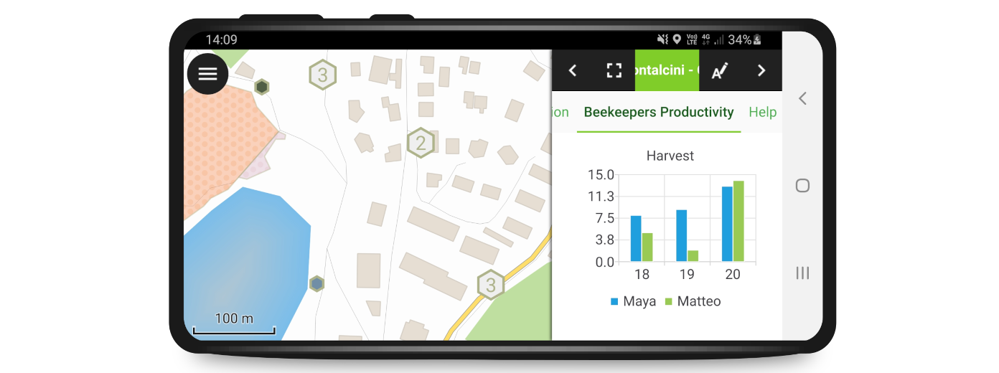

## Overview

The goal of this repo is to template elegant slides with
[**opengis.ch**](https://www.opengis.ch/) themes, based on the awesome
[`reveal-md`](https://www.npmjs.com/package/reveal-md) plugin. So you can
quickly draft presentations with simple markdown syntax, without getting into
HTML, CSS, and JS.

* [Overview](#overview)
* [Creating and editing presentations on the fly](#creating-and-editing-presentations-on-the-fly)
   * [Live-preview of slides via VSCode plugin](#live-preview-of-slides-via-vscode-plugin)
   * [Browser presentation modus](#browser-presentation-modus)
   * [Header section of the markdown presentation](#header-section-of-the-markdown-presentation)
* [Tips and Tricks](#tips-and-tricks)
   * [Overriding font styling](#overriding-font-styling)
   * [Images](#images)
   * [Tables](#tables)
   * [Handling multiple lines](#handling-multiple-lines)
   * [Having two or more equal sized columns](#having-two-or-more-equal-sized-columns)
* [Build the slides in your custom IDE](#build-the-slides-in-your-custom-ide)
* [Credits](#credits)

## Creating and editing presentations on the fly

The easiest way is to locally draft presentations in markdown and use the
preview functionality in VSCode.


### Live-preview of slides via VSCode plugin

The `VSCode Reveal` plugin supports live-preview of the slides. You can
just click on the plugin on the left bar, which features a slide overview and
currently four toolbar buttons at the top. If you split the editor right and
click on `"Revealjs: Show presentation by side"`, then you can instantly
navigate through the current snapshot of your presentation. To work on a local
version of the presention, simply do:

1. Install VSCode with the extension
   [`vscode-reveal`](https://marketplace.visualstudio.com/items?itemName=evilz.vscode-reveal)
2. Clone this repository, to re-use existing contents in the default branch:
```{bash}
git clone git@github.com:opengisch/talks_revealmd.git
```
3. Browse relevant existing content in the `slides` folder.
4. Optionally create a new local branch named after your new presentation;
   especially if you already know that the content will be relevant for re-use.
```{bash}
git checkout -b <my-example-presentation>
```
5. Create a new markdown file, `<my-example-presentation>.md`.
6. If slide material is interesting for others, you can publish your
   local presentation into this online repository. If you wish that your
   presentation is available on the **landing page** throught automated
   rending via GitHub actions, then make a pull request into the master branch
   on GitHub.

Now you are ready to draft and present your slides.

### Browser presentation modus

There is also a browser presentation modus, which is triggered by the
`<Revealjs: Open presentation in browser>` icon (vertical up-pointing arrow).


### Header section of the markdown presentation

Start with adding a header section in YAML syntax to the `.md` file, for
example:

Use `pitch-theme` for heavy-titled slides for pitches like this:
<image of marcos slide>.

```{yaml}
---
title: QField
description: QField Feature presentation
theme: theme/pitch-theme.css
customTheme: _assets/theme/pitch-theme
verticalSeparator: --v--
transition: none
revealOptions: {
  transition: 'none',
  slideNumber: false,
  overview: true,
  autoPlayMedia: true,
}
---
```

Use `teaching-theme` for slimmer font for workshop and teaching presentations.
<image of teaching slide>.

## Tips and Tricks

### Overriding font styling

If you want to override section levels of `#QField` style to pink, you can
do this manually with CSS inlining:

```html
<h1 style="color:pink">QField</h1>
```

Classes used in <span> (not only)

### Images

If you want to set an image as slide background, use this:

```{html}
<!-- .slide: data-background="./assets/mercator-bw.jpg"-->
```

To set the size of the image, use this syntax:

```{md}
{width="100%" height="30%"}
```

Note that you need to specify both `width` and `height`.

### Tables

Standard markdown tables are supported out of the box:

```{md}
| item   | description                     |
|--------|---------------------------------|
| list A | Contains A elements of type `A` |
| list B | Contains elements of type `B`   |
```

### Handling multiple lines


### Having two or more equal sized columns

If you want to place text and other elements, you can use containers:

```{html}
<div class="container">
<div class="col">column 1</div>
<div class="col">column 2</div>
<div class="col">column 3</div>
</div>
```

Please not that the HTML tags MUST be without any indentation, otherwise the
content is not correctly parsed from the `.md` file.

## Build the slides in your custom IDE

Above, we have locally compiled the slides via a VSCode plugin. If you prefer
other editors, simply render the slides with this docker command glued to a key
binding etc.:

```{bash}
# replace this one with the webserver version
docker run --rm -v $(pwd)/slides:/slides \
  -v $(pwd)/html:/html webpronl/ryeveal-md:latest /slides \
  --static /html --assets-dir assets --static-dirs _assets/theme
```

Alternatively, you can get the lastest stable version with the npm manager
(might need to upgrade/install npm before):

```{bash}
# Using Ubuntu OS
curl -fsSL https://deb.nodesource.com/setup_current.x | sudo -E bash -
sudo apt-get install -y nodejs
# sudo npm install -g npm@latest
npm install -g reveal-md
```

Build the slides with

```{bash}
reveal-md slides/qfield.md
```

## Credits

- [reveal.js](https://revealjs.com/) made Hakim El Hattab and contributors
- [reveal-md](https://github.com/webpro/reveal-md) made by Lars Kappert and
  contributors