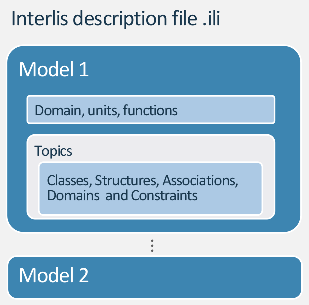

<!-- .slide: data-background="./assets/interlis_crashcourse/images/title.png" -->


<h1 style="-webkit-text-stroke: 2px var(--opengisch-dark) !important; color: lightgray !important; font-size:4.5em !important; text-align: center !important;">INTERLIS CRASHKURS</h1>


<!--
# Einführung (15 Minuten)
- Begrüssung
- Programm
- Was ist INTERLIS

# Erstes Modell (20 Minuten)
- Fallbeispiel EGID
- Basic INTERLIS Syntax (Model, Topic, Class)
- Erstes supereasy Model

# Datentypen und Constraints (25 Minuten)
- Erstelle die Datentypen
- Erstelle Constraints

# Pause (15 Minuten)

# Beziehungen und Referenzen (10 Minuten)
- ASSOCIATIONS und STRUCTURES
- BAG OF und LIST OF

# Vererbungen (20 Minuten)

# Kataloge (15 Minuten)

# Interlis Repositories und Tools (15 Minuten)

# Fragen (15 Minuten) 🙋

-->

---

### Ziele des Crashkurses

- Wissen was INTERLIS ist und wie es angewendet wird.
- Ein Modell lesen zu können und sich darin zurechtfinden. 

--v--

### WARNING ;-)

- Ihr werdet danach (vermutlich) keine INTERLIS Experten sein.
- Um das Verständniss zu verbessern, wurden bewusst Teile "ausgelassen", die sonst wichtig sind.
- Ihr werded noch immer Dinge in Modellen sehen, die ihr nicht kennt.

--v--

### Programm

- Was ist INTERLIS überhaupt?
- Schreiben des erstes Modells
- Datentypen und Bedingungen
- ☕

--v--

### Programm

- Beziehungen und Referenzen
- Vererbungen
- Aufzählungen und Kataloge
- Repositorien (Schweizer Geodatenmodelle)

---

Kurze Einführung...

## Was ist INTERLIS überhaupt?

--v--

- **INTER** **L**and **I**nfomations **S**ysteme
- Eine konzeptionelle Beschreibungsprache, mit spezieller Berücksichtigung von **Geodaten**
- Lesbar von Menschen und Maschinen
- Objektorientiert und Erweiterbar
- Systemneutral (Plattformunabhängig)
- Strikte Trennung zwischen Modell und Transferdaten

<!-- 
**INTER** **L**and **I**nfomations **S**ysteme -> dient der Zusammenarbeit von (Geographischen) Informations Systemen. Alle beteiligten Systeme sollen die Konzepte kennen, die für die Zusammenarbeit wichtig sind. 

Es umfasst also eine **konzeptionelle Beschreibungssprache**, welche die Realwelt beschreibt. Ist also lesbar von Menschen wie von Maschinen und ideal als Grundlage zur Diskusion zwischen IT-Nerds und thematischen Fachleuten.

Objektorientiert seit Version 2 (gängige version ist 2.3 obwohl 2.4 die aktuelle ist). Die Tatsache, dass es Objektorientiert ist führt dazu, dass es ideal ist für den Datenaustausch zwischen Bundesstellen / Kantonsstellen etc.
-->

--v--

### Modelldatei und Transferdatei

Das Modell (die Struktur) ist geschrieben in INTERLIS und gespeichert als `.ili` Datei.

Die Daten sind geschrieben in XML (gemäss Modell) und gespeichert als `.xtf` Datei (früher `.itf`).

--v--

### Wieso du INTERLIS mögen könntest

Du hast dein Datenbankschema in der Hosentasche.

Es ist "einfach" lesbar und sehr präzise.

Dank den Tools ist es einfach in deiner Datenbank und in QGIS zu implementieren und die Daten zu validieren.

<!-- 
Es gibt bestimmt genügend Gründe, INTERLIS nicht zu mögen.

Verglichen zu SQL Scripts ist es systemunabhängig und einfach zu erweitern. -->

---

Aber beginnen wir von vorn...
## Schreiben des erstes Modells

--v--

### Ausgangslage ✉️

{ style="height:8em"}

Clemens ist nicht glücklich. Bei jedem Datenaustausch muss er sich ransetzen und die Daten **überprüfen** und **bereinigen**.

--v--

- Werte sind nicht konsistent
- Einträge sind teilweise doppelt

Er schickt mir ein [Datensatz als CSV](./assets/interlis_crashcourse/gebaeude_clean.csv).

--v--

Lasst uns dafür ein supereasy Modell schreiben...
### INTERLIS Basics

--v--

{ style="display: block; margin: 0 auto" }

--v--

#### MODEL

<!-- echte syntax kodierung zeigen oder eben nicht? -->
```NONE
INTERLIS <interlis_version>;

MODEL <modellname_und_version> (<sprache>)

AT "<url_oder_email>"

VERSION "<datum>"  =


  [...]


END <modellname_und_version>.
```

--v--

#### MODEL (aus realem Modell)

```NONE
INTERLIS 2.3;

MODEL Wildruhezonen_LV95_V2_1 (de)

AT "https://models.geo.admin.ch/BAFU/"

VERSION "2020-04-21"  =


  [...]


END Wildruhezonen_LV95_V2_1.
```

--v--

#### TOPIC
<!-- echte syntax kodierung zeigen oder eben nicht? -->

```NONE
  TOPIC <topic_name> =

    [...]

  END <topic_name>;

```

--v--

#### TOPIC (aus realem Modell)

```NONE
INTERLIS 2.3;

MODEL Wildruhezonen_LV95_V2_1 (de)

AT "https://models.geo.admin.ch/BAFU/"

VERSION "2020-04-21"  =

  TOPIC Wildruhezonen =

    [...]

  END Wildruhezonen;

END Wildruhezonen_LV95_V2_1.
```

--v--

#### CLASS und ATTRIBUTES

<!-- echte syntax kodierung zeigen oder eben nicht? -->
```none
    CLASS <class_name> =

      <attribute_name> : <type>;
      <attribute_name> : <type>;
      <attribute_name> : <type>;

    END <class_name>;
```

--v--

#### CLASS und ATTRIBUTES (aus realem Modell)

```none
INTERLIS 2.3;

MODEL Wildruhezonen_LV95_V2_1 (de)

AT "https://models.geo.admin.ch/BAFU/"

VERSION "2020-04-21"  =

  TOPIC Wildruhezonen =

    CLASS Wildruhezone =
      ObjNummer : 0 .. 9999;
      Name : TEXT*80;
      Grundlage : TEXT;
      Kanton : MANDATORY CHAdminCodes_V1.CHCantonCode;
      Beschlussjahr : MANDATORY INTERLIS.GregorianYear;
    END Wildruhezone;

    CLASS Routennetz =
      Geo_Obj : Linie;
      Wegtyp : TEXT;
      Einschraenkung : TEXT;
    END Routennetz;

  END Wildruhezonen;

END Wildruhezonen_LV95_V2_1.
```

--v--

#### Das erste Modell 📝
Schreiben wir das Modell für Clemens' CSV File

<!--
1. Wir schreiben:
Gebaeudeinventar_V1

2. Wir importieren das Model mit Model Baker und schauen die Tabelle an.

3. Wir ziehen CSV rein und copy-pasten und haben die Daten.

4. Wir exportieren die Daten und sind nun schon "voll interlis"

"Das ist eigentlich kein Bestandteil von diesem Crashkurs. Aber nur um zu zeigen, wie einfach es sein könnte. Was wir aber fairerweise sagen müssen ist, dass wir nun natürlich das Model 1 zu 1 schrieben und die Sturktur und Attributnamen nicht änderten."
-->

---

Machen wir unser Modell nützlich mit...
## Datentypen und Bedingungen (Constraints)

--v--

### Ausgangslage ✉️

{ style="height:8em"}

Aber Clemens möchte korrekte Daten erhalten und abliefern.

Um nur korrekte Daten zu erlauben, möchten wir die Möglichkeiten ***einschränken***.

--v--

Geben wir die Wertbereiche vor mit...
### INTERLIS-Datentypen

--v--

#### Zeichenketten

**Uneingeschränkter Text**

`
Strasse : TEXT;
`

**Eingeschränke Länge**

`
Strasse : TEXT*200;
`

**Mehrere Zeilen**

`
Adresse : MTEXT;
`

**URL Format**

`
Website : URI;
`

--v--

#### Numerische Werte

**Eingeschränkte Nummer**

`
Flaeche : 0 .. 2000;
`

**Kommastellen**

`
Flaeche : 0.00 .. 2000.00;
`

--v--

#### Boolean (Wahr/Falsch, 0/1, On/Off)

`
Zivilschutzraum : BOOLEAN;
`

--v--

#### Datum und Zeit

**Jahr - GregorianYear (1582 .. 2999)**

`
Jahrgang_Heizung : INTERLIS.GregorianYear;
`

**Datum - XMLDate (Year - Month - Day)**

`
Datum_Heizung : INTERLIS.XMLDate;
`

**Eingeschränkte Zeit**

`
Datum_Heizung : INTERLIS.XMLDateTime "2000-01-01T00:00:00.000" ..
 "2005-12-31T23:59:59.999";
`

<!-- Von INTERLIS vordefinierte Werte, deshalb wird der Prefix INTERLIS benötigt. -->

--v--

#### Aufzählungen

Enumerations müssen wir selbst definieren:
```none
Farbe = (rot,
 gelb,
 gruen);
```
Dafür sind sie dann superpraktisch:

`
Fassadenfarbe : Farbe;
`

--v--

#### Datentypen im Modell 📝
Passen wir unser Modell an...

<!--
Gebaeudeinventar_V1_1

1. Wir schränken Texte ein.
2. Wir machen einige Felder numerisch.
3. Wir machen Zivilschutzraum BOOLEAN
4. Wir machen Datum_Heizung zu INTERLIS.XMLDate

Und dann machen wir die ENUMERATIONS (mach mal das Beispiel mit Kantonen):
Kanton = (
AG,AI,AR,BE,BL,BS,FR,GE,GL,GR,JU,LU,NE,NW,OW,SG,SH,SO,SZ,TG,TI,UR,VD,VS,ZG,ZH
)

Natürlich könnte man das noch machen für Status, Bauperiode, Heizung...

Evtl. können wir es auch noch testen mit Model Baker (je nach Zeit)
-->

--v--

Werfen wir noch einen Blick auf die...
### Koordinaten

--v--

#### IST Zustand

<!-- aktuell sind die Koordinaten so gespeichert-->

```none
CLASS Gebaeude =

  EKoordinate : 2460000.000 .. 2870000.000;
  NKoordinate : 1045000.000 .. 1310000.000;

END Gebaeude;
```

--v--

#### Und es heisst doch...

*INTERLIS ist eine konzeptionelle Beschreibungsprache, mit spezieller Berücksichtigung von **Geodaten**.*

--v--

#### Wir möchten es lieber irgedwie so...

```none
CLASS Gebaeude =

  Koordinaten : COORD
      2460000.000 .. 2870000.000 [m] {CHLV95[1]},
      1045000.000 .. 1310000.000 [m] {CHLV95[2]},
      ROTATION 2 -> 1;

END Gebaeude;
```

**Oder noch lieber irgendwie so...**

```none
CLASS Gebaeude =

  Koordinaten : Coord;

END Gebaeude;
```

--v--

#### Definiert im Basismodell des Bundes `GeometryCHLV95_V1`

```none
    Coord2 = COORD
      2460000.000 .. 2870000.000 [m] {CHLV95[1]},
      1045000.000 .. 1310000.000 [m] {CHLV95[2]},
      ROTATION 2 -> 1;
```

--v--

#### Somit verwenden wir es so

```none
CLASS Gebaeude =

  Koordinaten : GeometryCHLV95_V1.Coord2;

END Gebaeude;
```

--v--

#### Linien und Polygone

```none
      Linie = POLYLINE WITH (STRAIGHTS) VERTEX GeometryCHLV95_V1.Coord2;

      Polygon = SURFACE WITH (STRAIGHTS) VERTEX GeometryCHLV95_V1.Coord2 WITHOUT OVERLAPS > 0.001;
```

--v--

#### Koordinaten im Modell 📝

Passen wir unser Modell an...

<!--
Gebaeudeinventar_V1_2
1. Wir machen die GeometryCHLV95_V1.Coord2
2. Und führen den IMPORT ein
-->

--v--

<!-- Ein Grossteil von Bedingungen haben wir ja bereits gemacht mit dem definieren von Wertebereichen und Formaten. Dennoch gibt es noch mehr Möglichkeiten.-->

Führen wir Bedingungen ein mit...
### INTERLIS-Constraints 
(einer Auswahl)

--v--

#### Pfilchtfelder (NOT NULL)

`
Status : MANDATORY TEXT;
`

Könnte auch mit einem Constraint abgefangen werden:

```none
CLASS Gebaeude =

  Status : TEXT;

  MANDATORY CONSTRAINT DEFINED (Status);

END Gebaeude;
```

--v--

#### Einmaligkeit

```none
CLASS Gebaeude =

  AdrID : MANDATORY TEXT*8;
  EGID : MANDATORY TEXT*8;

  UNIQUE AdrID;
  UNIQUE EGID;

END Gebaeude;
```

--v--

#### Kombinationen von Bedingungen
```none
CLASS Gebaeude =

  Status : TEXT;
  WeitereInformationen: TEXT;

  MANDATORY CONSTRAINT DEFINED (Status) OR DEFINED (WeitereInformationen);

END Gebaeude;
```

--v--


#### Bedingungen unter Bedingungen 🤯
```none
CLASS Gebaeude =

  Status : TEXT;
  WeitereInformationen: TEXT;

  SET CONSTRAINT WHERE NOT DEFINED (Status) :
    DEFINED (WeitereInformationen);

END Gebaeude;
```

--v--

#### Bedingungen ausserhalb der Klasse

```none
CLASS Gebaeude =

  Status : TEXT;
  WeitereInformationen: TEXT;

END Gebaeude;

/* Constraint für Gebaeude */

CONSTRAINTS OF Gebaeude =

  SET CONSTRAINT WHERE NOT DEFINED (Status) :
      DEFINED (WeitereInformationen);

END;
```

--v--

#### Bedingungen im Modell 📝

Passen wir unser Modell an...

<!--
Gebaeudeinventar_V1_3
1. Wir machen die GeometryCHLV95_V1.Coord2
2. Und führen den IMPORT ein
-->

---

<h1 style="-webkit-text-stroke: 2px var(--opengisch-dark) !important; color: lightgray !important; font-size:4.5em !important">Pause</h1>

<!-- .slide: data-background="./assets/interlis_crashcourse/images/pause.jpg" -->

---

Verbessern wir unser Modell mit...
## Beziehungen und Referenzen

--v--

### Ausgangslage ✉️

{ style="height:8em"}

Clemens sagt, seine Daten im aktuellen Modell seien nicht valide:
Die `UNIQUE` Bedingungen werden nicht erfüllt.

Beispiel: EGID 470080

<!-- Schauen wir den Eintrag an und sehen. Oha, mehrere Adressen. -->

--v--


Ein Gebäude kann mehrere Adressen haben. Eine Adresse hingegen muss einem Gebäude zugewiesen werden.

--v--

### Was wir brauchen

- Neue "Tabelle" für Adressen
- Eine Verknüpfung zwischen Gebäude und Adressen

--v--

### Neue Klasse "Adresse" im Modell 📝

Passen wir unser Modell an...

<!--
Gebaeudeinventar_V1_4
1. Wir machen eine neue Klasse für "Adresse"
2. Wir verschieben alle Attribute, die Adresse betreffen
-->

--v--

Verknüpfen wir die Klassen mit...
### Beziehungen

--v--

#### ASSOCIATION

<!-- echte syntax kodierung zeigen oder eben nicht? -->
```none

ASSOCIATION <association_name>  =

  <rolle> <stärke> {<kardinalität>} <ziel_class>;
  <rolle> <stärke> {<kardinalität>} <ziel_class>;

END <association_name>;
```

--v--

#### ASSOCIATION (aus realem Modell)
```none

ASSOCIATION RoutennetzWildruhezone =

  WRZ_Routennetz -- {0..*} Routennetz;
  WRZ -<#> {1} Wildruhezone;

END RoutennetzWildruhezone;
```

<!-- Eine Wildruhezone kann keines oder mehrere Routennetze haben. Ein Routennetz aber muss genau einer Wildruhezone angehören. -->

--v--

#### Beziehungsstärken

- Assoziation `--`: Beziehung zwischen unabhängigen Objekten

- Aggregation `-<>`: Beziehung zwischen einem Ganzen und Teilen. Ein Teil kann mehreren Ganzen angehören.

- Komposition `-<#>`: Beziehung zwischen einem Ganzen und Teilen. Ein Teil kann nur einem Ganzen angehören.

<!-- Wenn eine Wildruhezone gelöscht wird, werden auch die darauf referenzierenden Routennetze gelöscht. -->

--v--

#### Beziehungsattribute

```none

ASSOCIATION RoutennetzWildruhezone =

  WRZ_Routennetz -- {0..*} Routennetz;
  WRZ -<#> {1} Wildruhezone;
  
  IstHauptroute: BOOLEAN;

END RoutennetzWildruhezone;
```

--v--


#### Beziehung im Modell 📝

Passen wir unser Modell an...

<!--
Gebaeudeinventar_V1_4
3. Wir erstellen eine ASSOCIATION
4. Evtl. schauen wirs in QGIS an
-->

--v--

### Alternativer Ansatz mit STRUCTURES

Wenn eine Adresse nicht eigenständig existieren kann würde vielleicht Sinn machen, die Adressen in ein "Datentyp" zu packen.

--v--

#### STRUCTURE

<!-- echte syntax kodierung zeigen oder eben nicht? -->
```none

STRUCTURE <structure_name>  =

  <attribute_name> : <type>;
  <attribute_name> : <type>;
  <attribute_name> : <type>;

END <structure_name>;
```

--v--

#### STRUCTURE (aus realem Modell)

<!-- gibt vielleicht noch ein besseres -->
```none

    STRUCTURE Address =

      Strasse : TEXT;
      Number : 0 .. 999;

    END Address;
```

--v--

#### Referenz auf STRUCTURE

<!-- gibt vielleicht noch ein besseres -->
```none

    CLASS Building =
      Adress: Address;
    END Building;
```

Oder eben mit mehreren Adressen mit `BAG {1..*} OF `

```none

    CLASS Building =
      Adress: BAG {1..*} OF Address;
    END Building;
```

--v--

#### STRUCTURES im Modell 📝

Passen wir unser Modell an...

<!--
Gebaeudeinventar_V1_5
3. Erstellen eine STRUCTURE "Adresse"
4. Erstelle Adressen: BAG {1..*} OF Adresse;
-->

---

Erweitern wir unser Modell mit...
## Vererbungen

--v--

### Ausgangslage ✉️

{ style="height:8em"}

Clemens arbeitet nun an einem Projekt, alle Gebäude auf den bestmöglichen Umweltstandard zu bringen.

Dazu möchte er das aktuelle Modell nutzen, doch fehlen einige Attribute und Bedingungen.

--v--

**Zusätzliche Attribute**
- Stromversorgung
- Datum_Stromversorgung
- Isolation
- Datum_Isolation

**Zusätzliche Bedingungen**
- Name soll ein Pflichtfeld sein
- Wenn die Bauperiode "Vor 1919" ist, kann es nicht dem bestmöglichen Standard ensprechen  

--v--

### Was wir brauchen

- Eine verbesserte `Gebaeude` Klasse 

--v--

Durchführen einer...
### Klassenerweiterung

--v--

#### Erweitern eines Modells

Um eine Klasse erweitern zu können müssen wir zuerst das Modell erweitern:


```NONE

MODEL <name_erweitertes_modell> (<sprache>)  =

  IMPORTS  <name_basis_modell>;

  TOPIC <name_erweitertes_topic> 
  EXTENDS <name_basis_modell>.<name_basis_topic> = 

    [...]

```

--v--

#### Erweitern einer Klasse mit Attributen

```NONE

    CLASS <name_basis_klasse> (EXTENDED) = 

      <name_basis_attribute> (EXTENDED) : <restriktiverer_constraint> <type>;

      <name_zusätzliches_attribute> : <type>;
      
      [...]

```

oder auch

```NONE

    CLASS <name_erweiterte_klasse> EXTENDS <name_basis_klasse> = 

      <name_basis_attribute> (EXTENDED) : <restriktiverer_constraint> <type>;

      <name_zusätzliches_attribute> : <type>;
      
      [...]

```

--v--

#### Erweiterung einer Klasse (aus realem Modell)

```NONE

MODEL GL_Wildruhezonen_V1 (de)  =

  IMPORTS Wildruhezonen_LV95_V2_1;

  TOPIC Wildruhezonen 
  EXTENDS Wildruhezonen_LV95_V2_1.Wildruhezonen =

    CLASS Wildruhezone (EXTENDED) =

      /** Zusätzliches Attribut*/
      Zielart: GL_Wildruhezonen_Codelisten_V1.Codelisten.Zielarten_CatRef;
      
      [...]

```

--v--

#### Vererbungen im Modell 📝

Erstellen wir ein erweitertes Modell...

<!--
OekoGebaeudeinventar_V1
- Erweitern um die Attribute
- Erweitern um die Constraints
-->

--v--

#### Typen von Klassen

<!-- Übrigens gibt es nicht nur das (EXTENDED sondern auch FINAL und ABSTRACT) -->

- Erweitert `(EXTENDED)`
- Abstrakt `(ABSTRACT)`
- Nicht erweiterbar `(FINAL)`

---

Nutzung von...
## Katalogen

--v--

### Ausgangslage ✉️

{ style="height:8em"}

Clemens hörte schon viel von Katalogen. Macht es Sinn diese in unserem Modell zu verwenden?

--v--

### Was sind Kataloge?

- Dynamische Wertelisten, die wie Aufzählungen (`ENUMERATIONS`) verwendet werden können.
- Kataloge sind Daten "gehören" aber zur Struktur (Modell)

--v--

#### Vorteile von Katalogen
- Sind bezüglich Inhalt von der eigentlichen Modelldefinition unabhängig.
- Können mehrsprachig sein
- Können zusätzlich zum Wert auch noch Beschreibung etc. enthalten

--v--

#### Nachteil von Katalogen
- Sind komplex

*Deshalb wird hier auch nur oberflächlich auf Kataloge eingegangen. Wichtig ist, dass man versteht, was Kataloge sind und wie sie verwendet werden.*

<!-- mit INTERLIS 2.4 wird's bisschen einfacher -->

--v--

#### Struktur eines Katalogs

Ableitungen von `CatalogueObjects_V1` erweitern die abstrakten Klassen und Strukturen

```none
CLASS Bestimmungen_Catalogue
EXTENDS CatalogueObjects_V1.Catalogues.Item =

    Code : MANDATORY TEXT*5;
    Description : MANDATORY LocalisationCH_V1.MultilingualText;

END Bestimmungen_Catalogue;


STRUCTURE Bestimmungen_CatRef
EXTENDS CatalogueObjects_V1.Catalogues.MandatoryCatalogueReference =

    Reference (EXTENDED) : MANDATORY REFERENCE TO (EXTERNAL) Bestimmungen_Catalogue;

END Bestimmungen_CatRef;

```

--v--

#### Referenzen auf Kataloge

```none
CLASS Wildruhezone_Teilobjekt =

  Bestimmungen : MANDATORY Wildruhezonen_Codelisten_V2_1.Codelisten.Bestimmungen_CatRef;

END Wildruhezone_Teilobjekt;
```

--v--

#### Kataloge im Modell 📝

Wir erstellen ein neues Katalog-Topic in unserem Modell für "Heizung".

<!-- Man könnte auch ein extra Modell für den Katalog machen. Dies macht aber nur Sinn, wenn man die Kataloge in verschiedenen Modellen nutzen möchte. >

<!--
Gebaeudeinventar_V1_6
- IMPORT CatalogueObjects_V1
- TOPIC Katalog erstellen
- DEPENDS ON Katalog
- Heizung : MANDATORY Katalog.Heizung_CatRef;
-->

---

Und zum Schluss noch...
## Interlis Repositories und Tools

--v--

### Arbeiten mit INTERLIS

(Graphik von landnetwork.ch)

--v--

### ili2 Tools
made by Eisenhut Informatik 

--v--

#### Compiler ili2c

Der INTERLIS-Compiler prüft ein INTERLIS-Modell, ob die Konstrukte der Sprache INTERLIS korrekt angewendet wurden. 

<!--Er meldet syntaktische Fehler im Modell mit der Zeilennummer, damit sie vom Modellierer korrigiert werden können.-->

--v--

#### ili2db und ili2fme
ili2pg, ili2gpkg und ili2fgdb sind Programme, die eine physische Datenbank (PostgrSQL/PostGIS, GeoPackage oder ESRI FileGDB) aus einem INTERLIS-Modell erzeugen oder eine INTERLIS-Transferdatei importieren / exportieren.

--v--

#### ilivalidator
ilivalidator prüft, ob Daten im INTERLIS 1 und 2 Transferformat (*.itf/*.xtf) mit dem zugehörigen Modell (*.ili) übereinstimmen. 

--v--

### Schweizer Geodaten Repositories

--v--

#### ilimodels.xml
- Basiert auf dem Modell `IliRepository09`
- Enthält Objekte der Klasse `ModelMetadata`, in denen ein Modellname und ein **Dateipfad** definiert ist
- Die **Dateien** befinden sich in demselben Repository

--v--

#### ilisites.xml

- Basiert auf dem Modell `IliSite09`.
- Enthält Objekte der Klasse `SiteMetadata`, in denen **Pfade** zu anderen Repositories definiert sind
  http://models.interlis.ch/ilisite.xml -> http://models.geo.kgk-cgc.ch/ilisite.xml -> http://models.geo.sh.ch/ilisite.xml

<!-- [*Let's have a look*](http://models.interlis.ch/) -->

---

<h1 style="-webkit-text-stroke: 2px var(--opengisch-dark) !important; color: lightgray !important; font-size:4.5em !important">Fragen?</h1>

<!-- .slide: data-background="./assets/interlis_crashcourse/images/fragen.png" -->

---

#### Das wars. Vielen Dank.
#### Web: www.opengis.ch
#### Email: david@opengis.ch
#### Github: github.com/signedav
#### Mastodon: @signedav@techhub.social
