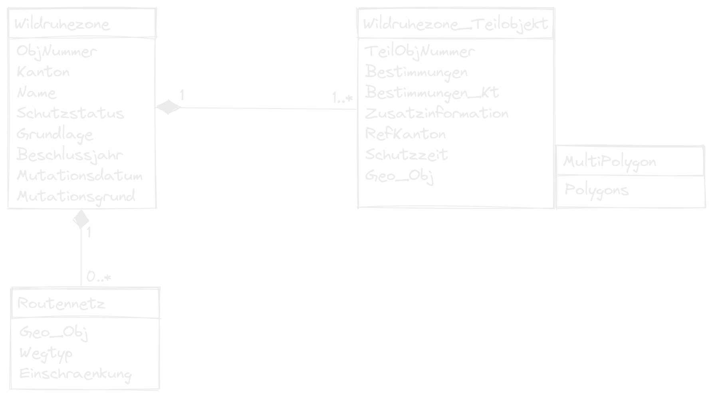

# What is INTERLIS?

---

- INTER Land Information Systems
- A data description language with special consideration of **geodata**
- Object oriented and extendable
- System neutral (platform independent)
- Readable by humans and machines
- Model driven approach

<!-- [INTERLIS](https://www.interlis.ch/) (INTER Land Information Systems) is a data description language and a transfer format with special consideration of geodata. INTERLIS offers the possibility to describe spatial data precisely, to integrate them in conformity with the model and to exchange them easily among different users. INTERLIS has been bindingly anchored in Swiss geoinformation legislation since 2008. Since INTERLIS has been object-oriented since version 2, it can be extended very easily. This means that, for example, the federal government defines a model that the cantonal authorities can derive and extend according to their needs. 

- Supports Geometries
- Since version 2 object oriented - perfect for data exchange between authorities. This is important since it's anchored in Swiss geoinformation legislation since 2008 to use INTERLIS.
- Perfect for the discussion between ITs and thematic specialists
- Strict division between the transfer part and the modeling part
-->

---

## Model file and transfer data file

The model is defined in INTERLIS language and stored in an `.ili` file.

The data is in xml (considering the model) and stored as an `.xtf` file (former `.itf`).

---

## Why you could like INTERLIS

You have your database schema in your poket. 

It's easy readable and precice.

Thanks to the nice tools, it's easy to implement in your database and in QGIS.

<!--  Compared to e.g. SQL Scripts you can simply extend it. -->

---

# INTERLIS Modelling in 10 Minutes

---

## Model Structure


<!-- A model contains Units, Functions, Domains, Classes, Structures and Topic definitions.
Contains all definitions to describe a part of the modeled reality.
-->

---

```
INTERLIS 2.3;
MODEL Wildruhezonen_LV95_V2_1 (de)
AT "https://models.geo.admin.ch/BAFU/"
VERSION "2020-04-21"  =

  DOMAIN
    Punkt = GeometryCHLV95_V1.Coord2;

  TOPIC Wildruhezonen =

    CLASS Routennetz =
      Name : MANDATORY TEXT*80;
    END Routennetz;

  END Wildruhezonen;
END Wildruhezonen_LV95_V2_1.
```

---

## Classes

**Syntax**
```
ClassDef =  'CLASS' Class-Name '='
              { AttributeDef }
            'END' Class-Name ';'.
```

**Example**
```   
CLASS Wildruhezone =
  ObjNummer : MANDATORY 0 .. 9999;
  Name : MANDATORY TEXT*80;
END Wildruhezone;
```
<!-- Classes are like templates to create objects (class elements) from. Or entities in the context of databases. They have properties described as attributes. -->

---

## Attributes

**Syntax**
```
AttributDef = Attribute-Name : [MANDATORY] 
                               Type | DomainRef;

DomainRef = [ Model-Name '.' [ Topic-Name '.' ] ] Domain-Name
```

**Example**
```
Name : MANDATORY TEXT*80;
Schutzstatus : MANDATORY Wildruhezonen_Codelisten_V2_1.Codelisten.Schutzstatus_CatRef;
```

---

## Structures

**Syntax**
```
StructureDef =  'STRUCTURE' Struct-Name '='
                  { AttributeDef }
                'END' Struct-Name ';'.
```

**Example**
```
STRUCTURE PolygonStructure =
  Polygon: SURFACE WITH (STRAIGHTS) VERTEX GeometryCHLV03_V1.Coord2 WITHOUT OVERLAPS > 0.001;
END PolygonStructure;

STRUCTURE MultiPolygon =
  Polygons: BAG {1..*} OF PolygonStructure;
END MultiPolygon;
```
<!-- Formally similar to classes are Structures but factually they are more like types or value ranges. They describe how more complicated properties of objects are constructed. The structure elements, have no identity of their own, but are values of attributes of an object. So they cannot exist without belonging to an object of a class. -->

---

## Accociations 

**Syntax**
```
AssociationDef = 'ASSOCIATION' '='
                   { RoleDef }
                 'END' ';'.
RoleDef = Role-Name '--' ClassRef ';'.
```

**Example**
```
ASSOCIATION RoutennetzWildruhezone =
  WRZ_Routennetz -- {0..*} Routennetz;
  WRZ -<#> {1} Wildruhezone;
END RoutennetzWildruhezone;
```

---

## Extends
```
CLASS Wildruhezone =
  ObjNummer : MANDATORY 0 .. 9999;
  Name : MANDATORY TEXT*80;
END Wildruhezone;

CLASS Wildruhezone (EXTENDED) =
    /** Zuordnung der Zielarten Schutzbestimmung zur Wildruhezone */
    Zielart: GL_Wildruhezonen_Codelisten_V1.Codelisten.Zielarten_CatRef;
END Wildruhezone;
```
<!-- Of course to extend classes, topics needs to be extended as well. And with the class attributes can be extended as well. -->

---

## Types of classes
- Concrete
- Abstract
- Final
- Derivate/Extended

```

CLASS Wildruhezone (ABSTRACT)=
END Wildruhezone;
```
<!-- Keywords to enforce or prevent specialization -->

---

## What are catalogues?

Catalogues are external codelists that can be used like `Enumerations` but less static.
Catalogues are data but "belong" to the data model.

<!-- You can use the "old" model but update your catalogue. -->

---

## Structure of a catalogue

Catalogues base on the model `CatalogueObjects_V1` and extend the abstract classes and structures

```
CLASS Bestimmungen_Catalogue
EXTENDS CatalogueObjects_V1.Catalogues.Item =
    Code : MANDATORY TEXT*5;
    Description : MANDATORY LocalisationCH_V1.MultilingualText;
END Bestimmungen_Catalogue;

STRUCTURE Bestimmungen_CatRef
EXTENDS CatalogueObjects_V1.Catalogues.MandatoryCatalogueReference =
    Reference (EXTENDED) : MANDATORY REFERENCE TO (EXTERNAL) Bestimmungen_Catalogue;
END Bestimmungen_CatRef;
```

---

## Reference to the catalogue

```
CLASS Wildruhezone_Teilobjekt =
  Bestimmungen : MANDATORY Wildruhezonen_Codelisten_V2_1.Codelisten.Bestimmungen_CatRef;
END Wildruhezone_Teilobjekt;
```

---

## Have a look at a simple model

[Buildings](./assets/demo_models/super_simple_buildings_V1.ili)

---

## Have a look at the real model [Wildruhezonen_V2_1](./assets/demo_models/Wildruhezonen_V2_1.ili)

<!-- Mention IMPORTS -->

---



---

## Check out the real model extended for Glarus [GL_Wildruhezonen_V2_1](./assets/demo_models/GL_Wildruhezonen_V1_2020-03-31.ili)

---

# INTERLIS implementation workflow and tools

---


(Graphic by landnetwork.ch)

---

# ili2 Tools
made by Eisenhut Informatik 

---

## Compiler ili2c

The INTERLIS Compiler checks an INTERLIS model if the constructs of the language INTERLIS were applied correctly. It reports syntactic errors in the model with the line number so that they can be corrected by the modeler.

---

## ili2fme and ili2db
ili2pg, ili2gpkg and ili2fgdb are programs that write an INTERLIS transfer file according to an INTERLIS model into a database (PostgrSQL/PostGIS, GeoPackage or ESRI FileGDB) or create such a transfer file from a database.

---

## ilivalidator
The ilivalidator tool checks whether data in the INTERLIS 1 and 2 transfer format (*.itf/*.xtf)  complies with the associated model (*.ili). License terms and further information about the ilivalidator can be found here.

---

# Swiss geodata repositories

---

## ilimodels.xml
- Based on the model `IliRepository09`
- Contains objects of the class `ModelMetadata` where a model name and a file path is defined
- The files are on the same repository

---

## ilisites.xml

- Based on the model `IliSite09`
- Contains objects of the class `SiteMetadata` where path to other repositories are defined
http://models.interlis.ch/ilisite.xml -> http://models.geo.kgk-cgc.ch/ilisite.xml -> http://models.geo.sh.ch/ilisite.xml

[*Let's have a look*](http://models.interlis.ch/)

---
