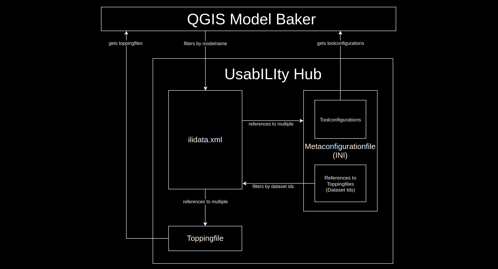

# QGIS MODEL BAKER 

---

##  While INTERLIS is the hard stuff

<!-- .slide: data-background="./assets/walter_white.webp" -->

<!-- I might sound like a nerd, but in fact you can get addicted to it. Sometimes ideas appear to model everything in INTERLIS. It's a common thing when you have to do with people using INTERLIS. In fact I thought about to make this presentation (and an abstract and extended version of it) in INTERLIS. -->

---

## MODEL BAKER is the beginner drug

<!-- .slide: data-background="./assets/johnny_depp.webp" -->

---

# What is MODEL BAKER?

---

## A QGIS Project Generator

Quickly **creates a QGIS project** from a physical data model. 

Analyzes the existing structure and configures a QGIS project with all available information. 

---

## A QGIS Project Generator optimized for INTERLIS

Models defined in INTERLIS provide **additional meta information** like domains, units of attributes or object oriented definitions of tables.

This can be used to further optimize the project configuration. 

<!-- Model Baker can use the meta information to configure layer tree, field widgets with conditions, form layouts, relations and much more.-->

---

## An ili2db controll station

```
java -jar /home/dave/dev/opengisch/QgisModelBaker/QgisModelBaker/libili2db/bin/ili2pg-4.6.1/ili2pg-4.6.1.jar --schemaimport --dbhost localhost --dbport 5432 
--dbusr postgres --dbpwd ****** --dbdatabase bakery --dbschema adsfdsaf2 --setupPgExt --coalesceCatalogueRef --createEnumTabs --createNumChecks --createUnique 
--createFk --createFkIdx --coalesceMultiSurface --coalesceMultiLine --coalesceMultiPoint --coalesceArray --beautifyEnumDispName --createGeomIdx --createMetaInfo 
--expandMultilingual --createTypeConstraint --createEnumTabsWithId --createTidCol --importTid --smart2Inheritance --strokeArcs --defaultSrsCode 2056 
--models Wildruhezonen_LV95_V2_1
```

<!-- It provides the user only the needed settings to pass parameters to the ili2db.
Creates the commando for ili2db.
-->

---

## And it's a library

Can be used as a framework.

Like [Asistente LADM-COL](https://github.com/SwissTierrasColombia/Asistente-LADM-COL), created for the [Colombian implementation of the Land Administration Domain Model (LADM)](https://www.proadmintierra.info/) does it.

<!--
Model Baker can be used as a framework for other projects. The plugin [Asistente LADM-COL](https://github.com/SwissTierrasColombia/Asistente-LADM-COL), created for the [Colombian implementation of the Land Administration Domain Model (LADM)](https://www.proadmintierra.info/), uses the Model Baker as a library to implement as much of the specific solution as possible as QGIS core functionality.
-->

---

## Check it out now

<!--
- super_simple_buildings to GPKG
- Wildruhezonen_V2_1.ili, wrz_bundesmodell.xtf, Wildruhezonen_Catalogues_V2_1.xml to Postgres
- show with Repo Wildruhezonen_LV95_V2_1 as well receiving the catalgue from repo to Postgres
- show with usabilityhub
- show with only having the xtf as source
- Import everything
- Show validation and export
-->

---

## What is the UsabILIty Hub?
Receive meta data like ***ili2db settings***, ***layer styles*** and ***orders*** etc. automatically over the web. 

See https://usabilityhub.opengis.ch/

And the [Model Baker Documentation](https://opengisch.github.io/QgisModelBaker/background_info/usabilityhub/modelbaker_integration/)

---

## ilidata.xml
Get the additional information with the `ilidata.xml` file on the UsabILIty Hub (currently https://models.opengis.ch) and the linked repositories. 

---

## Metaconfiguration and Toppings
Settings for tools are configured in a metaconfiguration file, as well as links to topping files that contain information about GIS project.

***Thus, this additional information usually consists of a metaconfiguration and any number of toppings.***

---


