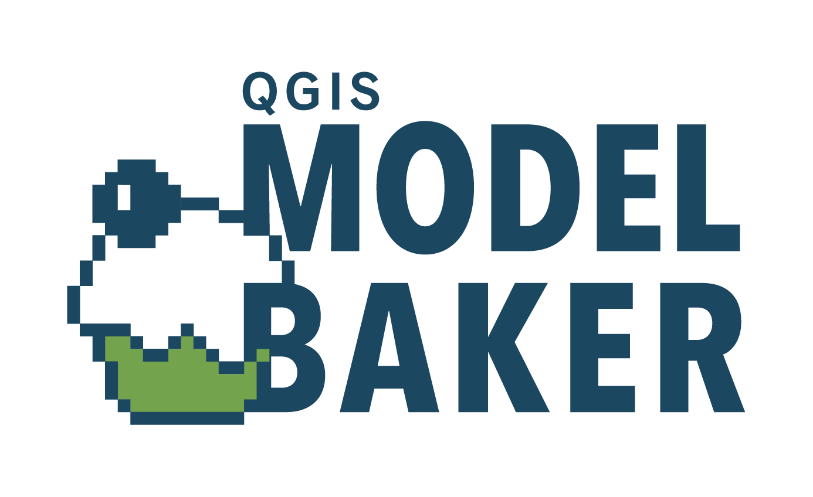

---

### Abstract

**Model Baker** ist ein **QGIS Plugin**, mit dem sich Projekte aus einem **INTERLIS** Modell erzeugen lassen. **Model Baker** verwendet **ili2db**, um ein Modell in eine **physische Datenbank** zu importieren und zusätzliche Metainformationen, um **Legende, Formulare, Relationen und vieles mehr** automatisch zu konfigurieren. Es ist **Open Source** und frei verfügbar.

---

### INTERLIS Geodatenmodell

Wir haben **INTERLIS** Modelle lokal oder auf dem Repository.

---

```
MODEL Wildruhezonen_LV95_V2_1 (de)
VERSION "2020-04-21"  =
  IMPORTS GeometryCHLV95_V1,LocalisationCH_V1,CHAdminCodes_V1,Wildruhezonen_Codelisten_V2_1;

  TOPIC Wildruhezonen =
    DEPENDS ON Wildruhezonen_Codelisten_V2_1.Codelisten;

    DOMAIN
      Polygon = SURFACE WITH (STRAIGHTS) VERTEX GeometryCHLV95_V1.Coord2 WITHOUT OVERLAPS > 0.001

    CLASS Wildruhezone =
      ObjNummer : MANDATORY 0 .. 9999;
      Kanton : MANDATORY CHAdminCodes_V1.CHCantonCode;
      Name : MANDATORY TEXT*80;
      Schutzstatus : MANDATORY Wildruhezonen_Codelisten_V2_1.Codelisten.Schutzstatus_CatRef;
      Grundlage : MANDATORY TEXT*250;
      Beschlussjahr : MANDATORY INTERLIS.GregorianYear;
      Mutationsdatum : INTERLIS.XMLDate;
      Mutationsgrund : LocalisationCH_V1.MultilingualMText;
    END Wildruhezone;

    CLASS Routennetz =
      Geo_Obj : MANDATORY Linie;
      Wegtyp : MANDATORY Wildruhezonen_Codelisten_V2_1.Codelisten.Wegtyp_CatRef;
      Einschraenkung : TEXT*254;
    MANDATORY CONSTRAINT NOT (Wegtyp->Reference->Code == "W1") OR NOT (DEFINED (Einschraenkung));
    END Routennetz;

    CLASS Wildruhezone_Teilobjekt =
      TeilObjNummer : MANDATORY TEXT*30;
      Bestimmungen : MANDATORY Wildruhezonen_Codelisten_V2_1.Codelisten.Bestimmungen_CatRef;
      Bestimmungen_Kt : LocalisationCH_V1.MultilingualMText;
      Zusatzinformation : TEXT*500;
      RefKanton : INTERLIS.URI;
      Schutzzeit : MANDATORY TEXT*250;
      Geo_Obj : MANDATORY Polygon;
    MANDATORY CONSTRAINT NOT (Bestimmungen->Reference->Code == "R900" OR Bestimmungen->Reference->Code == "E900") OR DEFINED (Bestimmungen_Kt);
    END Wildruhezone_Teilobjekt;

    ASSOCIATION RoutennetzWildruhezone =
      WRZ_Routennetz -- {0..*} Routennetz;
      WRZ -<#> {1} Wildruhezone;
    END RoutennetzWildruhezone;

    ASSOCIATION Wildruhezone_TeilobjektWildruhezone =
      WRZ_Teilobjekt -- {1..*} Wildruhezone_Teilobjekt;
      WRZ -<#> {1} Wildruhezone;
    END Wildruhezone_TeilobjektWildruhezone;
  END Wildruhezonen;
END Wildruhezonen_LV95_V2_1.
```

---

### Model Baker Plugin

**Model Baker** findet die relevanten Informationen und erstellt mithilfe von **ili2db** die Datenbank.

---

<!-- .slide: data-background="./assets/modelbaker_wizard.png" -->

---

### QGIS Projekt

Datenbank und INTERLIS Metadaten werden analysiert, um ein QGIS Projekt mit Legende, Formularen, Relationen und vielem mehr automatisch zu konfigurieren.

---

<!-- .slide: data-background="./assets/modelbaker_projekt.png" -->


