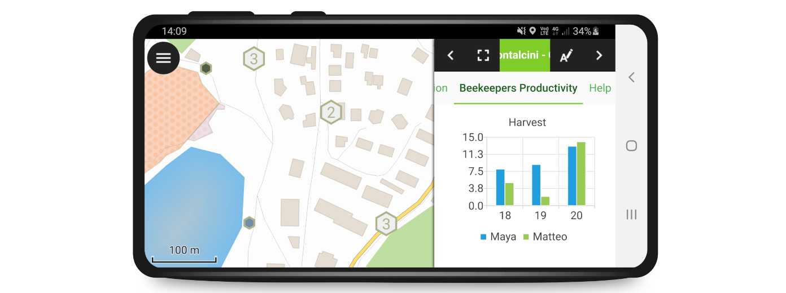

# QField
<h2 class=blue> Because data is outside</h2>

---

{width="100%" height="30%"}

#### Open source Geoninjas
### Made in Switzerland

---

## Why
# QField ?

---

<!-- .slide: data-background="./assets/mercator-bw.jpg"-->

## Because
# data is outside
## the office

---

## What is
# QField ?

---

{width="100%" height="30%"}

### The mobile data collection app for QIGS

---

<!-- .slide: data-background="./assets/qfield_canvas.png"-->

##### Minimalist UI

---

<!-- .slide: data-background="./assets/qfield_tec_green.jpg"-->

##### Beautiful cartography

---

<!-- .slide: data-background="./assets/powerful.png"-->

##### Powerful tools

---

<!-- .slide: data-background="./assets/efficient.png"-->

#### Efficient interaction

---

<!-- .slide: data-background="./assets/integrated.png"-->

##### Beneficial integrations

---

<!-- .slide: data-background="./assets/qfield_trimble.jpeg"-->

##### Professional hardware

---

<!-- .slide: data-background="./assets/cloud.png"-->

##### QFieldCloud

---

## How to work with
# QField ?

---

<!-- .slide: data-background="./assets/qgis_advanced_bee_farming.png"-->

##### Comfortably prepare the work on your QGIS desktop

---

<!-- .slide: data-background="./assets/qfield_on_field.jpg"-->

##### Efficiently work on your GIS data outdoor

---

<!-- .slide: data-background="./assets/qfield_cloud_synchronize.png"-->

##### Seamlessly synchronise

---

## What is in
# QField ?

---

## Powerful Feature Forms

--v--

#### Supercool Forms

<!-- .slide: data-background="black" -->

<video src="./assets/video/form_widgets.webm" controls></video>

--v--

#### Conditional visibility
<video data-autoplay src="./assets/video/conditional_visibility.webm" controls></video>

--v--

### Default Values
<video src="./assets/video/live_default.webm" controls></video>

---

## Camera and special widgets

--v--

### Camera
<video src="./assets/video/camera_file.webm" controls></video>

--v--

### QML Widgets
<video src="./assets/video/qml_html.webm" controls></video>

---

## Multi Attribute Editing

--v--

<video src="./assets/video/multi_editing.webm" controls></video>

---

## Relation integration

--v--

<video src="./assets/video/relation_widgets.webm" controls></video>

--v--

<video src="./assets/video/ordered_releation.webm" controls></video>

--v--

<video src="./assets/video/autocomplete.webm" controls></video>

---

## Opening of individual datasets

--v--

<video src="./assets/video/opening_individual_vector.webm" controls></video>

--v--

<video src="./assets/video/opening_individual_raster.webm" controls></video>

---

## Mapthemes

--v--

<video src="./assets/video/theme.webm" controls></video>

---

## Search for Attributes and Coordinates

--v--

<video src="./assets/video/search.webm" controls></video>

---

## Measuring tool

--v--

<video src="./assets/video/measuring.webm" controls></video>

---

## Geometry editing and drawing

--v--

<video src="./assets/video/edit_geom.webm" controls></video>

--v--

<video src="./assets/video/edit_topo.webm" controls></video>

--v--

<video src="./assets/video/freehand_drawing.webm" controls></video>

---

## GNSS and tracking

--v--

<video src="./assets/video/tracking.webm" controls></video>

--v--

<video src="./assets/video/NMEA.webm" controls></video>

---

## Print Atlas to PDF

--v--

<video src="./assets/video/print_pdf.webm" controls></video>

---

<!-- .slide: data-background="./assets/real_cloud.jpg"-->

---

<!-- .slide: data-background="./assets/windows_crop.jpg"-->

##### QField on Windows

---

<!-- .slide: data-background="./assets/ipad_crop.jpg"-->

##### QField on iOS

---

<!-- .slide: data-background="./assets/ipad_crop.jpg"-->

##### qfield.org/get

---

<!-- .slide: data-background="./assets/taivaskero.jpg"-->

##### Taivaskero
##### 400k downloads
##### 110k monthly users

---

<!-- .slide: data-background="./assets/qfield_love.png"-->

##### Join the effort

<!-- .slide: data-background="./assets/customer.JPG"-->

##### Your custom pp

---

### Thanks! Questions?
### qfield.org | qfield.cloud
### @opengisch
### info@opengis.ch
