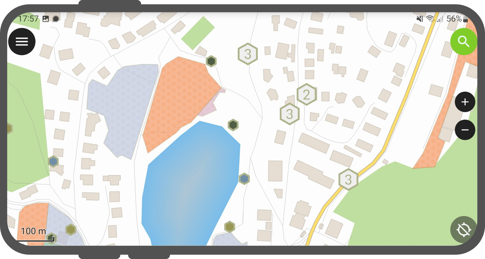
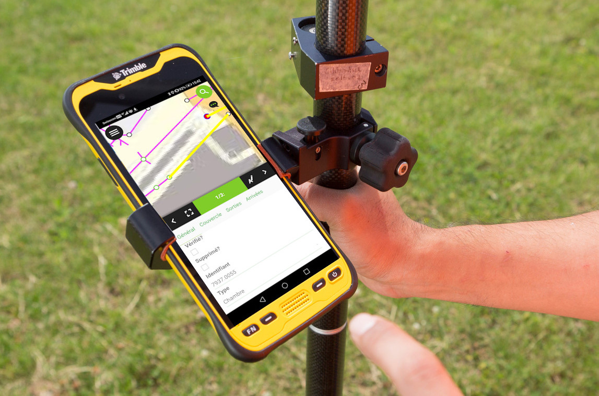
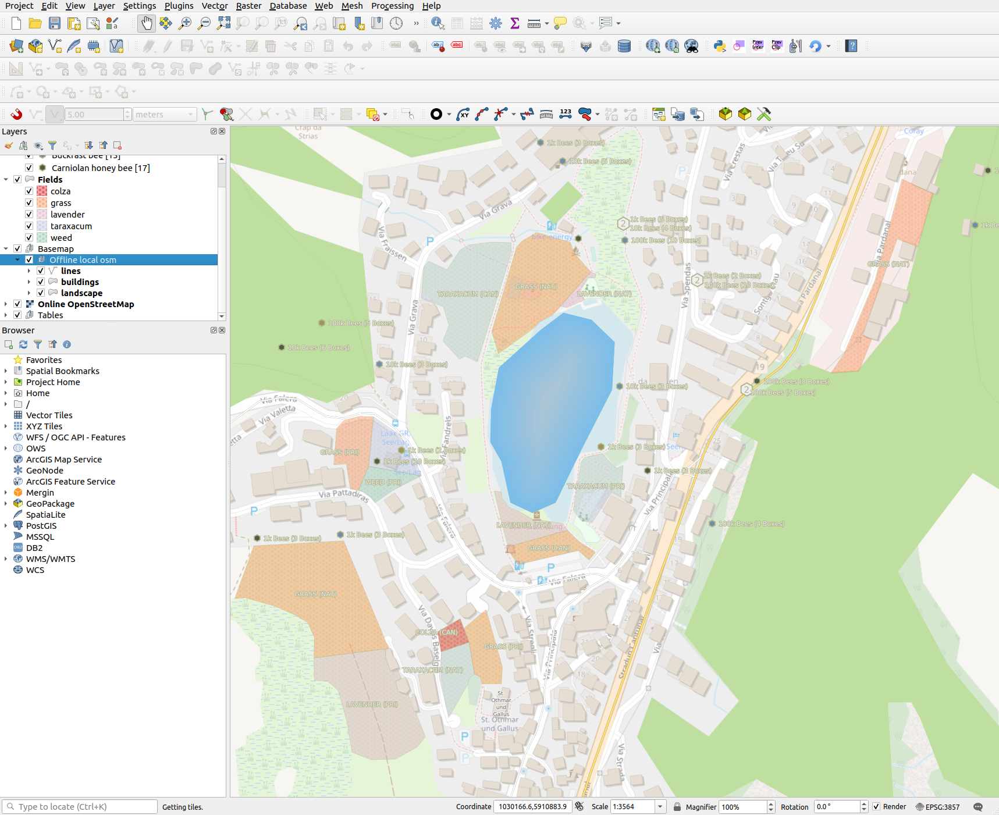
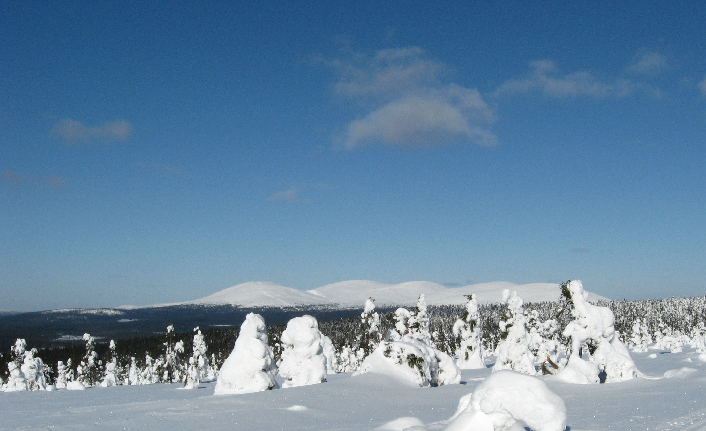
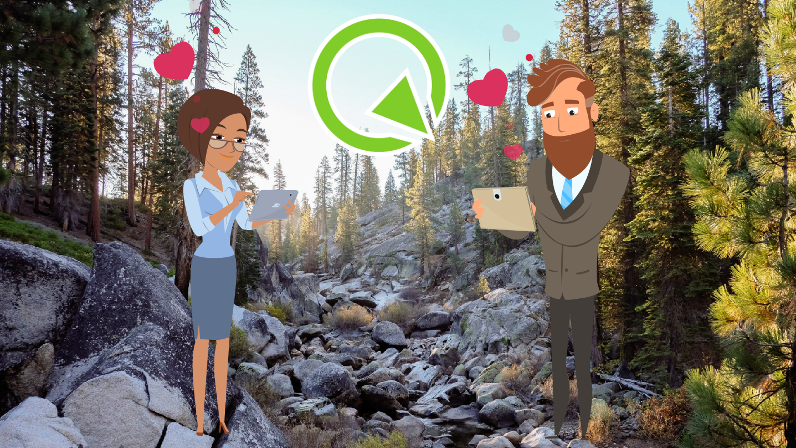

# QField
## Because data is outside

---

#### Open source Geoninjas
### Made in Switzerland

---

## Why
# QField ?

---

## Because
# data is outside
## the office

---

## What is
# QField ?

---

### The mobile data collection app for QIGS

---

##### Minimalist UI

---

##### Beautiful cartography

---

##### Powerful tools

---

##### Efficient interaction

---

##### Beneficial integrations

---

##### Professional hardware

---

##### QFieldCloud

---

## How to work with
# QField ?

---

##### Comfortably prepare the work on your QGIS desktop

---

##### Efficiently work on your GIS data outdoor

---

##### Seamlessly synchronise

---

## What is in
# QField ?

---

## Powerful Feature Forms

---

---

---

---

## Camera and special widgets

---

---

---

## Multi Attribute Editing

---

---

## Relation integration

---

---

---

---

## Opening of individual datasets

---

---

---

## Mapthemes

---

---

## Search for Attributes and Coordinates

---

---

## Measuring tool

---

---

## Geometry editing and drawing

---

---

---

---

## GNSS and tracking

---

---

---

## Print Atlas to PDF

---

---

---

##### QField on Windows

---

##### QField on iOS

---

##### qfield.org/get

---

##### Taivaskero
##### 400k downloads
##### 110k monthly users

---

##### Join the effort

---

##### Your custom app

---

### Thanks! Questions?
### qfield.org | qfield.cloud
### @opengisch
### info@opengis.ch
